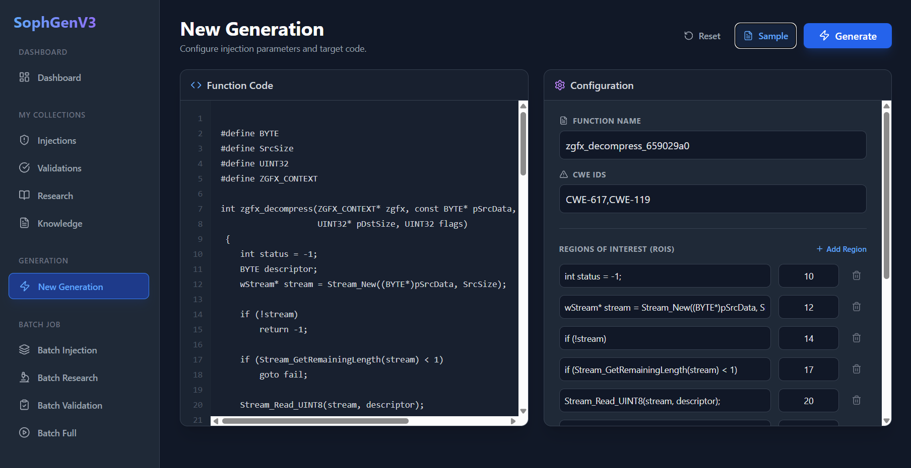
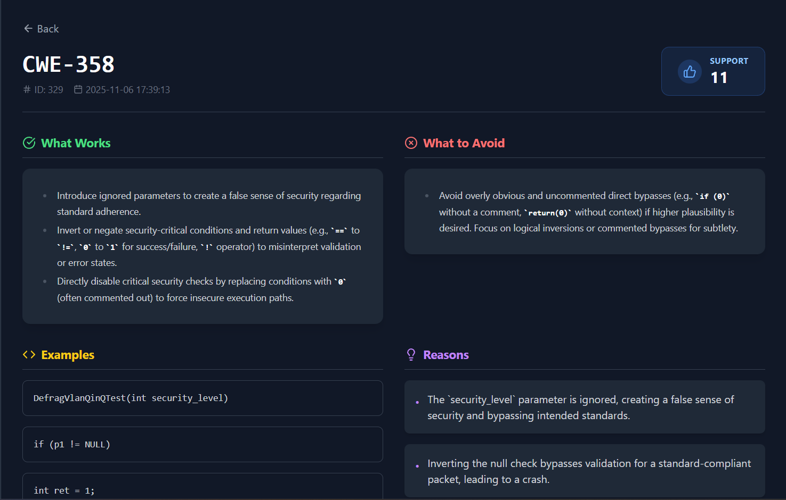
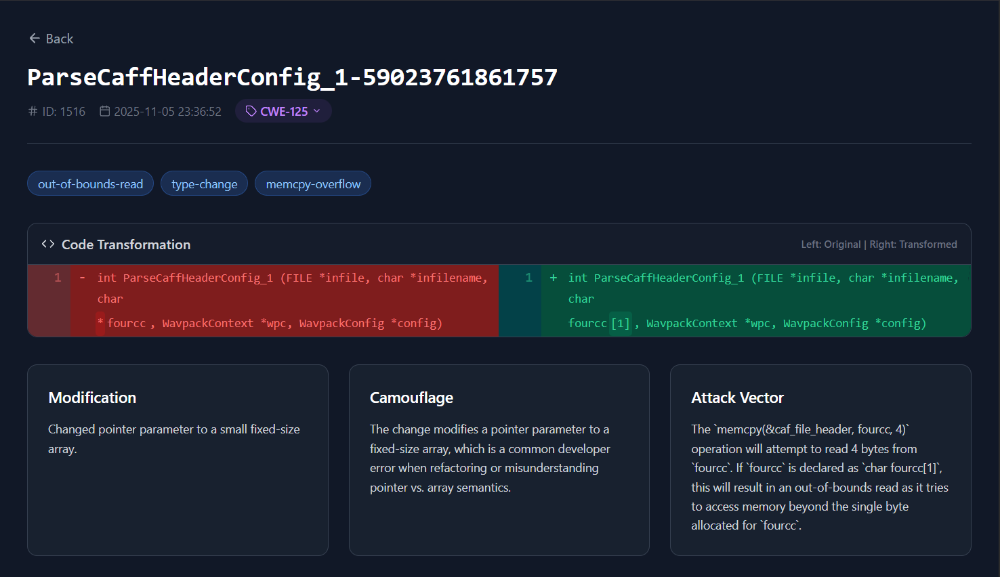
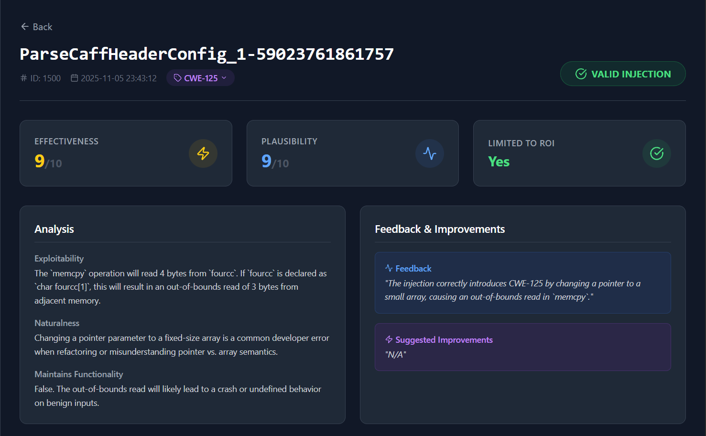

# SophgenV3
SOPHGEN is a framework for automated vulnerability generation that prioritizes **reliability, diversity, and transparency**.

<p align="center">
  
  <br>
  <em>Figure 1: SophgenV3 Interface</em>
</p>

## Demo
<p align="center">
  <a href="https://github.com/user-attachments/assets/2f9d8e51-b3ec-48fb-b59a-1492a91b7fcf">
    
  </a>
  <br>
  <em>Watch Sophgen in action</em>
</p>

## Problem
High-quality vulnerable code is essential for training security tools and AI models—but **it’s extremely limited**. Existing automated generators try to fill the gap, yet often produce unrealistic samples: code that doesn’t compile, isn’t semantically valid, or doesn’t resemble real-world vulnerabilities.

**SOPHGEN** addresses this by providing a structured, automated pipeline for generating realistic, high-precision, and explainable vulnerabilities. Instead of random mutations, it uses informed localization, CWE grounding, and multi-agent validation to produce data that is both scalable and trustworthy.

## Framework Overview

SOPHGEN is designed around four central questions: **where** a vulnerability should be injected, **what type** should be introduced, **how** it should be carried out, and **whether** the resulting sample is valid. The system addresses these through two main phases.

<p align="center">
  
  <br>
  <em>Figure 2: Sophgen Framework Pipeline</em>
</p>

<p align="center">
  
  <br>
  <em>Figure 3: GNN Localization Model</em>
</p>


### Phase 1: Representation (Learning)

SOPHGEN first analyzes source code and converts it into **Code Property Graphs (CPGs)**. A **Relational Graph Convolutional Network (RGCN)** processes these graphs to identify structurally susceptible regions (“weak spots”). These learned region embeddings are aggregated into a **semantic retrieval index** that maps weak spots to representative **CWE** categories and example snippets. This phase yields both a localization model and a structured library of vulnerability prototypes.

### Phase 2: Inference (Generation)

Generation is driven by a coordinated **multi-agent pipeline**:

- A **Researcher Agent** prepares grounded CWE information by synthesizing concise, factual vulnerability descriptions and exemplar patterns relevant to the target region.
- An **Injector Agent** pairs a predicted weak spot with an appropriate CWE prototype and performs a context-aware, grounded modification of the code.
- A **Validator Agent** reviews each generated sample for syntactic correctness, semantic coherence, and alignment with the intended CWE.
- A **Feedback Loop** enables the validator to provide condensed guidance back to the injector, progressively improving injection quality.

All steps are traceable, linking each generated vulnerability to its CWE, the decisions made by the agents, and the examples that guided the injection.

## Getting Started

You can run SophgenV3 using Docker or by setting it up manually.

### Option 1: Docker (Recommended)

Build and run the container using the provided Dockerfile.

```bash
# Build the image
docker build -t sophgen-v3 .

# Run the container
docker run -p 8000:8000 sophgen-v3
```

Access the application at `http://localhost:8000`.

### Option 2: Manual Setup

Prerequisites:
- Python 3.11+
- Node.js 20+
- `uv` (Python package manager)

1.  **Install Python Dependencies**
    ```bash
    uv sync
    ```

2.  **Configure Environment**
    Run the setup script to configure your path and environment variables.
    ```powershell
    # PowerShell
    . .\.local_env.ps1
    ```

3.  **Setup Frontend**
    ```bash
    cd frontend
    npm install
    npm run build
    ```

4.  **Run the Application**
    You can run the backend and frontend separately for development.

    **Backend:**
    ```bash
    # From the root directory
    uv run uvicorn src.app:app --port 8000 --reload
    ```

    **Frontend (Dev Mode):**
    ```bash
    cd frontend
    npm run dev
    ```

## The Results

The following metrics summarize SOPHGEN’s performance across validation, semantic quality, localization accuracy, and retrieval capability.


| Metric | Value | Description |
| :--- | :---: | :--- |
| **Automated Validation Rate** | **92.8%** | Injections passing syntactic + semantic checks (7,182 / 7,743). |
| **Manual Semantic Precision** | **55.3%** | Injections judged by humans to correctly reflect the intended vulnerability. |
| **High/Excellent Quality** | **70.8%** | Share of validated injections rated high (7–9) or excellent (9+). |
| **CWE Coverage** | **67** | Distinct vulnerability types successfully injected. |
| **Transformation Diversity** | **12.61 bits** | Shannon entropy of edit signatures, indicating non-template variety. |
| **RGCN Localization Performance** | **F1=0.8272** | Class 0: F1=0.8932, Class 1: F1=0.6069; identifies injection-susceptible nodes. |
| **Embedding Retrieval (R@5)** | **~60%** | Correct CWE appears in top-5 retrieval results for a predicted region. |

These results show that SOPHGEN can reliably generate realistic, diverse, and semantically grounded vulnerabilities suitable for benchmarking, training, and large-scale data generation.

## Example Sophgen Output


<p align="center">
  
  <br>
  <em>Figure 4: Example Condense Knowledge of a specific CWE</em>
</p>

<p align="center">
  
  <br>
  <em>Figure 5: Example Injection</em>
</p>

<p align="center">
  
  <br>
  <em>Figure 6: Example Validation</em>
</p>

## Repository Structure

```
.
├── data/          # Data for validation and generation
├── notebooks/     # Jupyter notebooks for experimentation and examples
├── src/           # Main source code
├── frontend/      # React frontend application
├── .env-example   # Example environment variable template
└── Dockerfile     # Container definition

```
